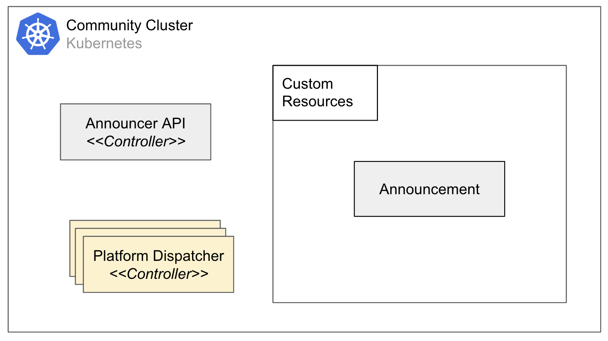
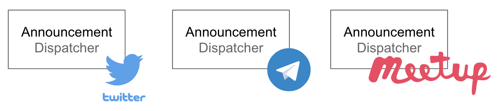

# Announcer API Design




This aims to be the initial design of Announcer API.

An Announcement can be constructed as per below spec:
```sh
apiVersion: announcer.cloudnative.id/v1alpha1
kind: Announcement
metadata:
  name: jakarta-kubernetes-meetup-jan2020
spec:
  content: >
    The meetup will be hosted by NodeFlux this month.
    Please come!
  platformRef:
    apiVersion: platform.announcer.cloudnative.id/v1alpha1
    kind: TelegramDispatcher
    name: cloudnativeid-bot
```
At the moment, an Announcement will be dispatched in real-time, but
next iteration it can also be scheduled in a specific time. Apart from `content`, Announcement can also have image that will be interpreted differently by different Dispatcher.

An Announcement has field `platformRef` which refers to a Dispatcher resource defined in Kubernetes:
```sh
apiVersion: platform.announcer.cloudnative.id/v1alpha1
kind: TelegramDispatcher
metadata:
  name: cloudnativeid-bot
spec:
  # Configuration of Telegram bot which is going to dispatch the announcement
  group: kubernetesindonesia
  # Some other dispatcher specific configuration goes here
  ...
```
